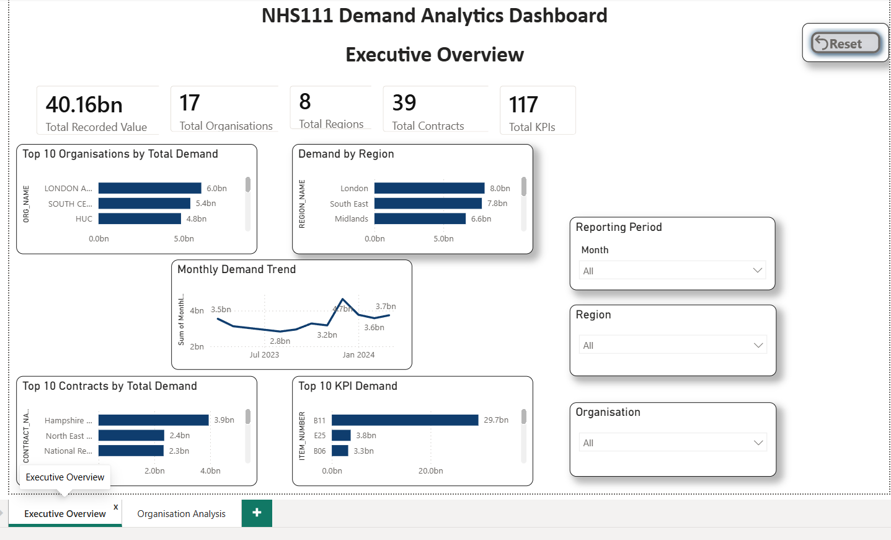
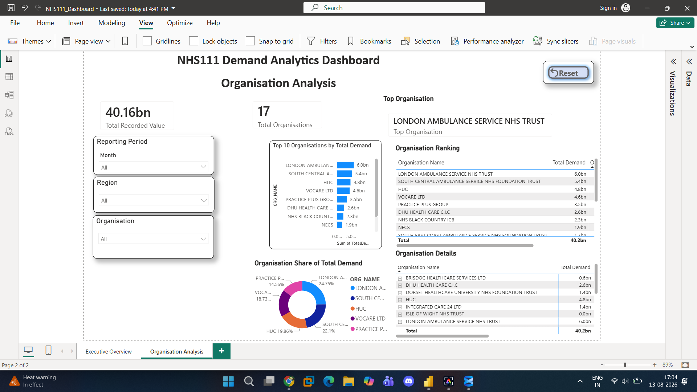

# NHS111 Demand Analytics

An end-to-end data analytics portfolio project analysing NHS111 demand data using **Python, SQL Server and Power BI**.

The project demonstrates a complete analytics workflow, including data exploration, data cleaning, SQL analysis, advanced SQL techniques, data validation, KPI analysis and interactive dashboard development.

## Project Objectives

The analysis was designed to answer key questions such as:

- Which NHS organisations have the highest recorded demand?
- Which regions contribute the most to overall demand?
- How does demand change over time?
- Which contracts and KPI codes account for the highest recorded values?
- What proportion of total demand is contributed by each organisation and region?
- Are there missing values or data-quality issues that could affect the analysis?

## Tools & Technologies

- **Python** – data exploration, cleaning and KPI mapping
- **Pandas** – data manipulation and validation
- **SQL Server** – data storage and analytical querying
- **T-SQL** – aggregations, CTEs, views and window functions
- **Power BI** – data modelling, DAX and interactive dashboards
- **GitHub** – project documentation and version control

## Project Workflow

### 1. Data Exploration

Initial exploration was performed to understand the structure and quality of the NHS111 dataset.

Checks included:

- Dataset dimensions
- Column names and data types
- Missing values
- Duplicate records
- Unique organisations, regions, contracts and KPI codes

### 2. Data Cleaning

Python was used to prepare and validate the dataset before analysis.

The cleaning process included:

- Missing-value investigation
- Duplicate checks
- Data-type validation
- Unique-value checks
- Preparation of fields required for analysis

### 3. SQL Analysis

The cleaned data was loaded into **SQL Server** for further analysis.

SQL analysis included:

- Organisation-level demand
- Regional demand
- Contract-level demand
- KPI-level demand
- Monthly demand analysis
- Creation of reusable SQL views

### 4. Advanced SQL

Advanced T-SQL techniques were used to perform deeper analytical calculations, including:

- `RANK()`
- `DENSE_RANK()`
- `ROW_NUMBER()`
- `LAG()`
- Running totals
- Common Table Expressions (CTEs)
- Window functions
- Month-on-month change
- Percentage contribution analysis

These queries provide ranking, trend and comparative analysis across organisations, regions, contracts and KPI codes.

### 5. Data Validation

A separate validation stage was used to check the reliability of the analytical outputs.

Validation included checks for:

- Missing values
- Duplicate records
- Organisation counts
- Region counts
- Contract counts
- KPI counts
- Total recorded values
- SQL view outputs

## Power BI Dashboard

The final Power BI report contains two interactive pages.

### Executive Overview

Provides a high-level view of NHS111 demand, including:

- Total Recorded Value
- Total Organisations
- Total Regions
- Total Contracts
- Total KPIs
- Top 10 Organisations by Total Demand
- Demand by Region
- Monthly Demand Trend
- Top 10 Contracts by Total Demand
- Top 10 KPI Demand
- Interactive reporting-period, region and organisation filters

### Organisation Analysis

Provides deeper organisation-level analysis, including:

- Top Organisation
- Organisation Ranking
- Organisation Demand Share
- Top 10 Organisations
- Organisation Details
- Interactive filtering and reset functionality

## Repository Structure

| File | Description |
|---|---|
| `01_Data_Exploration.ipynb` | Python exploratory data analysis |
| `02_Data_Cleaning.ipynb` | Python data cleaning and validation |
| `03_KPI_Mapping.ipynb` | KPI exploration and mapping |
| `01_Data_Exploration.sql` | SQL exploratory analysis |
| `02_Business_Analysis.sql` | Business-focused SQL analysis |
| `03_Create_Views.sql` | SQL views used for analytical reporting |
| `04_Advanced_SQL.sql` | CTEs, rankings, window functions and advanced analysis |
| `05_Data_Validation.sql` | Final SQL data-quality and validation checks |
| `NHS111_Dashboard.pbix` | Interactive Power BI dashboard |
| `Executive_Overview.png` | Executive dashboard screenshot |
| `Organisation_Analysis.png` | Organisation analysis screenshot |

## Key Skills Demonstrated

This project demonstrates practical experience with:

**Python • Pandas • SQL Server • T-SQL • CTEs • Window Functions • Data Cleaning • Data Validation • Data Analysis • DAX • Power BI • Dashboard Development • Data Visualisation • Business Intelligence**

## Dashboard Features

The Power BI dashboard includes interactive slicers for:

- Reporting Period
- Region
- Organisation

Reset functionality allows users to return dashboard filters to their default state.

## Project Outcome

This project demonstrates an end-to-end analytics workflow, transforming raw NHS111 data into structured analytical outputs and an interactive business intelligence dashboard.

It combines **Python for data preparation, SQL for analytical querying and Power BI for visualisation**, providing a portfolio example of practical data analytics and business intelligence skills.
