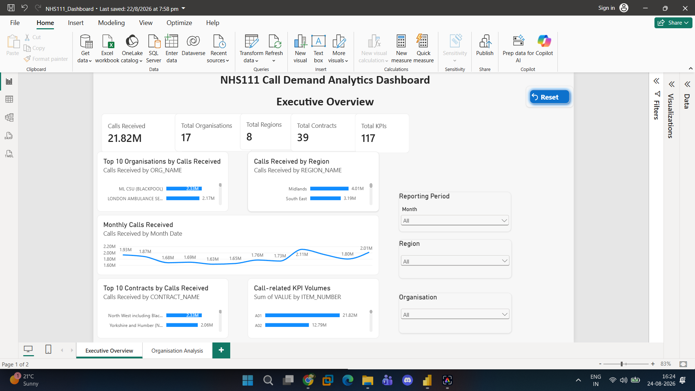
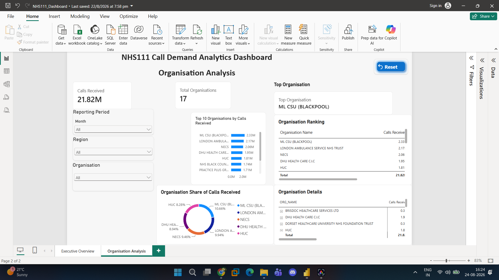

# NHS111 Call Demand Analytics

An end-to-end data analytics portfolio project analysing NHS111 call demand using **Python, SQL Server and Power BI**.

The project demonstrates a complete analytics workflow including data exploration, data cleaning, SQL analysis, advanced SQL techniques, data validation, KPI analysis and interactive dashboard development.

## Project Objectives

The analysis was designed to answer questions such as:

- How many NHS111 calls were received during the reporting period?
- Which NHS organisations received the highest number of calls?
- Which regions received the highest call volumes?
- How did calls received change month by month?
- Which contracts handled the highest call volumes?
- What proportion of total calls was contributed by each organisation and region?
- How do selected call-related KPI measures compare?
- Are there missing values or data-quality issues that could affect the analysis?

## Important KPI Definition

For call-demand analysis, this project uses:

**A01 = Number of calls received**

Only records where `ITEM_NUMBER = 'A01'` are used when calculating:

- Total Calls Received
- Organisation call volumes
- Regional call volumes
- Monthly call trends
- Contract call volumes
- Organisation rankings
- Organisation share of total calls

Other KPI codes are analysed separately and are **not summed together as total call demand**, because they represent different operational measures.

## Tools & Technologies

- **Python** – data exploration, cleaning and KPI mapping
- **Pandas** – data manipulation and validation
- **SQL Server** – data storage and analytical querying
- **T-SQL** – aggregations, CTEs, views and window functions
- **Power BI** – DAX, interactive dashboards and data visualisation
- **GitHub** – project documentation and version control

## Dataset Overview

The dataset contains:

- **51,948 records**
- **17 organisations**
- **8 regions**
- **39 contracts**
- **117 KPI codes**
- **12 reporting periods**
- Reporting period: **April 2023 to March 2024**

The validated total for KPI **A01 – Number of calls received** is:

**21,817,671 calls**

## Project Workflow

### 1. Data Exploration

Initial exploration was carried out in Python to understand the structure and quality of the NHS111 dataset.

Checks included:

- Dataset dimensions
- Column names and data types
- Missing values
- Duplicate records
- Unique organisations
- Unique regions
- Unique contracts
- Unique KPI codes
- Reporting periods

### 2. Data Cleaning

Python and Pandas were used to prepare the dataset for analysis.

The cleaning process included:

- Converting numeric values
- Investigating missing values
- Duplicate checks
- Data-type validation
- Reporting-period conversion
- Unique-value checks
- Preparing cleaned data for SQL analysis

### 3. SQL Analysis

The cleaned data was loaded into **SQL Server**.

Call-demand analysis uses KPI `A01` and includes:

- Calls received by organisation
- Calls received by region
- Monthly calls received
- Calls received by contract
- Creation of reusable SQL views

KPI-level analysis is kept separate from call-demand calculations.

### 4. Advanced SQL

Advanced T-SQL techniques were used for deeper analysis, including:

- `RANK()`
- `DENSE_RANK()`
- `ROW_NUMBER()`
- `LAG()`
- Common Table Expressions (CTEs)
- Window functions
- Running totals
- Month-on-month change
- Percentage contribution analysis
- Top-N analysis

These techniques were used to analyse A01 call volumes across organisations, regions, months and contracts.

### 5. Data Validation

A dedicated validation stage was used to confirm the accuracy of the analytical outputs.

Validation included:

- Total calls received
- Organisation counts
- Region counts
- Contract counts
- KPI counts
- Monthly call totals
- SQL view outputs
- Missing A01 values
- Comparison of annual and monthly totals

The validated total calls received was:

**21,817,671**

## Power BI Dashboard

The final Power BI report contains two interactive pages.

### Executive Overview

The Executive Overview provides a high-level view of NHS111 call activity, including:

- Total Calls Received
- Total Organisations
- Total Regions
- Total Contracts
- Total KPIs
- Top 10 Organisations by Calls Received
- Calls Received by Region
- Monthly Calls Received
- Top 10 Contracts by Calls Received
- Call-related KPI Volumes
- Interactive Reporting Period, Region and Organisation filters

### Organisation Analysis

The Organisation Analysis page provides deeper organisation-level analysis, including:

- Total Calls Received
- Total Organisations
- Top Organisation
- Top 10 Organisations by Calls Received
- Organisation Ranking
- Organisation Share of Calls Received
- Organisation Details
- Interactive filtering and reset functionality

## Key Findings

- A total of **21.82 million NHS111 calls** were received between April 2023 and March 2024.
- **December 2023** recorded the highest monthly call volume at approximately **2.11 million calls**.
- **ML CSU (BLACKPOOL)** recorded the highest organisation-level call volume at approximately **2.33 million calls**.
- The **Midlands** recorded the highest regional call volume at approximately **4.01 million calls**.
- Monthly call volumes generally ranged between approximately **1.63 million and 2.11 million calls**.

## Repository Structure

| File | Description |
|---|---|
| `01_Data_Exploration.ipynb` | Python exploratory data analysis |
| `02_Data_Cleaning.ipynb` | Python data cleaning and validation |
| `03_KPI_Mapping.ipynb` | KPI exploration and mapping |
| `01_Data_Exploration.sql` | SQL exploratory analysis |
| `02_Business_Analysis.sql` | Business-focused A01 call analysis |
| `03_Create_Views.sql` | SQL views for analytical reporting |
| `04_Advanced_SQL.sql` | CTEs, rankings, window functions and advanced call analysis |
| `05_Data_Validation.sql` | Final SQL validation checks |
| `NHS111_Dashboard.pbix` | Interactive Power BI dashboard |
| `Executive_Overview.png` | Executive dashboard screenshot |
| `Organisation_Analysis.png` | Organisation analysis screenshot |

## Key Skills Demonstrated

**Python • Pandas • SQL Server • T-SQL • CTEs • Window Functions • Data Cleaning • Data Validation • Data Analysis • DAX • Power BI • Dashboard Development • Data Visualisation • Business Intelligence**

## Dashboard Features

The Power BI dashboard includes interactive slicers for:

- Reporting Period
- Region
- Organisation

Reset functionality allows users to return dashboard filters to their default state.

## Project Outcome

This project demonstrates an end-to-end analytics workflow, transforming raw NHS111 data into validated call-demand analysis and an interactive business intelligence dashboard.

The project combines **Python for data preparation, SQL for analytical querying and validation, and Power BI for interactive reporting and visualisation**.

A key part of the analysis was correctly separating **A01 calls received** from other KPI measures so that unrelated KPI values were not combined and misinterpreted as total NHS111 call demand.
